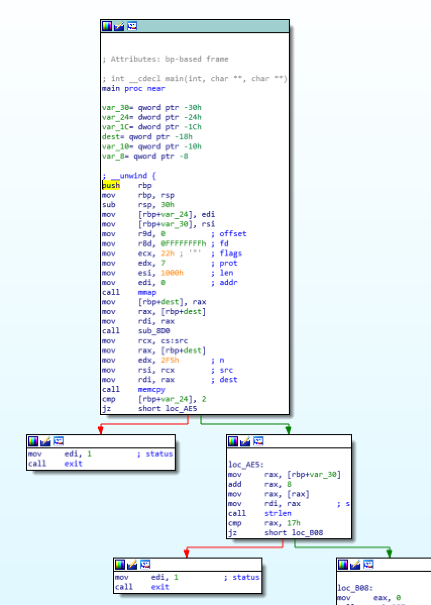
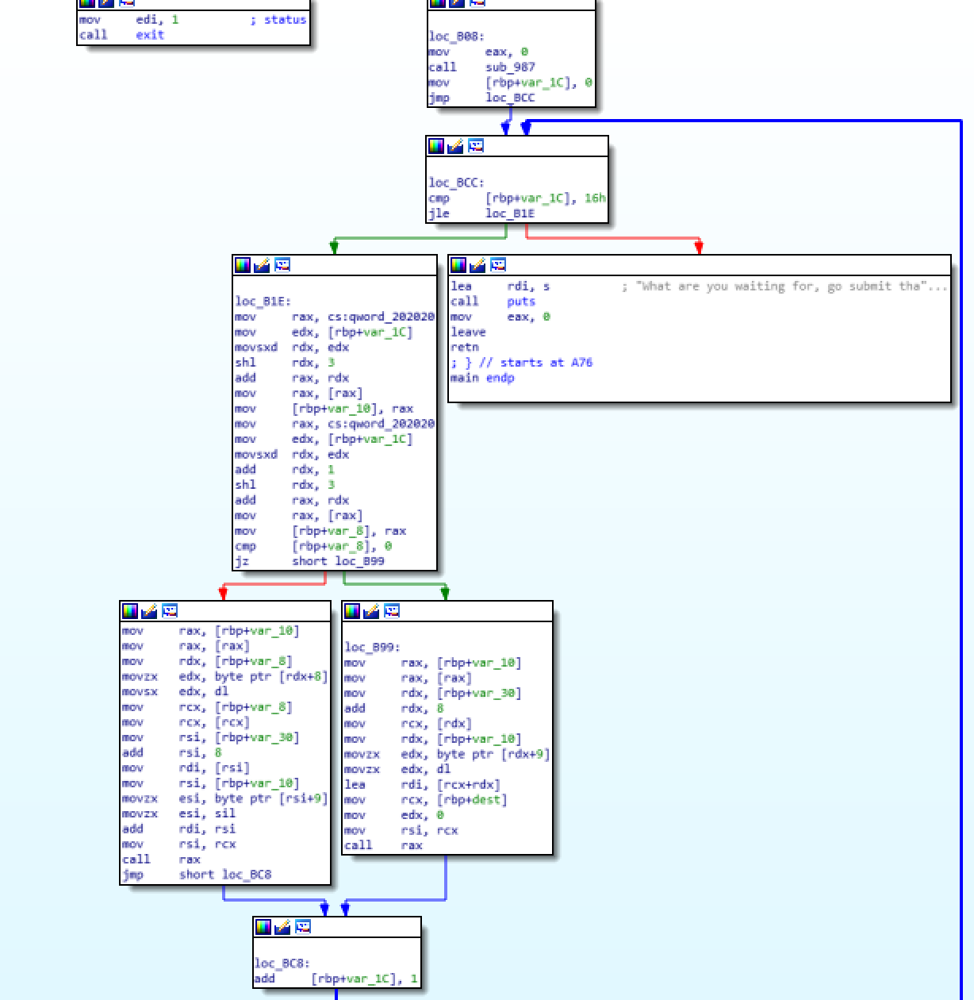
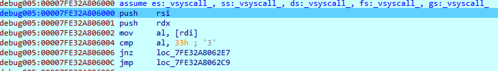
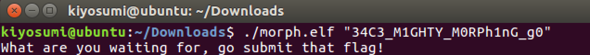

# 2017_34c3ctf - m0rph(49)

FILE : x64 ELF

실행해보면 그냥 아무것도 안하고 끝난다.

IDA로 열어보면 인자가 있는지 체크하고, 또 그 인자의 길이가 0x17(23)인지 체크한다.

조건 만족시

0x17번 반복루틴을 진행하면서 검증한다.

이후는 정적분석으로는 잘 모르겠어서 IDA의 Remote Debugging을 이용하여 동적분석하였다.

CALL RAX 부근을 조사해보면

syscall로 추정되는 함수(?)를 호출하면서 한 글자씩 검증한다. 순서는 rand()함수를 통해 나온 값으로 결정하는 것으로 보인다.

필자는 그냥 Zero Flag를 하나하나 바꾸며 노가다뛰었다.

flag is 34C3_M1GHTY_M0RPh1nG_g0

