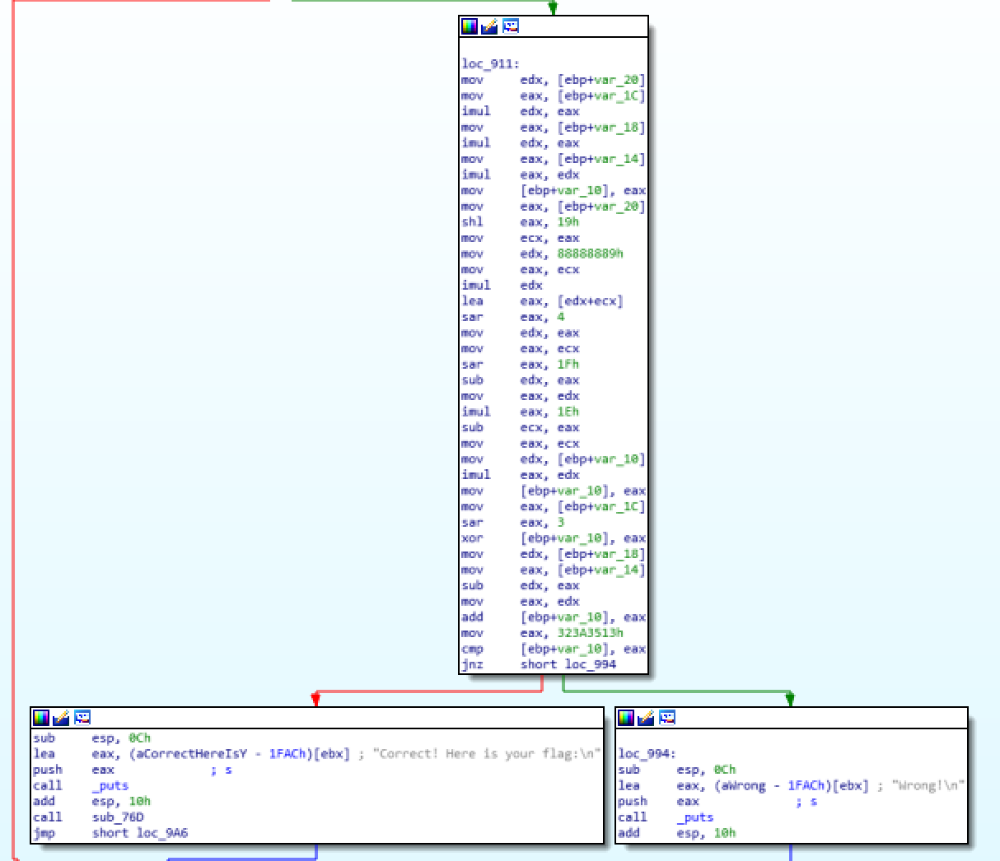

# 2017_34c3_junior_ctf - saturn(136)

FILE : x32 ELF FILE


int 값 4개를 시간 내에 입력받는 프로그램이다.

IDA로 열어보면 sub_843이 주요 함수임을 확인할 수 있다.


우선 int 값 4개를 입력받은 뒤, 범위가 123456789~987654321 사이인지 확인한다.



이후 모든 값이 범위 내일 경우 위와 같은 루틴을 통과한 뒤 EAX가 0x323A3513인지 검증하고, 정답 여부를 판별한다.


### Solution code

```c
#include <iostream>

int main(){

	int k;

	for (int a = 123456789; a <= 987654321; a++)
		for (int b = 123456789; b <= 987654321; b++)
			for (int c = 123456789; c <= 987654321; c++)
				for (int d = 123456789; d <= 987654321; d++){
					k = a * b * c * d * ((a << 25) % 30);
					k ^= b >> 3;
					k += (c - d);

					if (k == 842675475)
						printf("%d %d %d %d\n",a,b,c,d);
				}

	system("pause");
}
```


※ flag 파일은 서버에 있는 관계로 현 시각 확인불가


