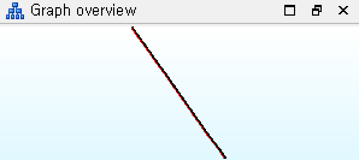
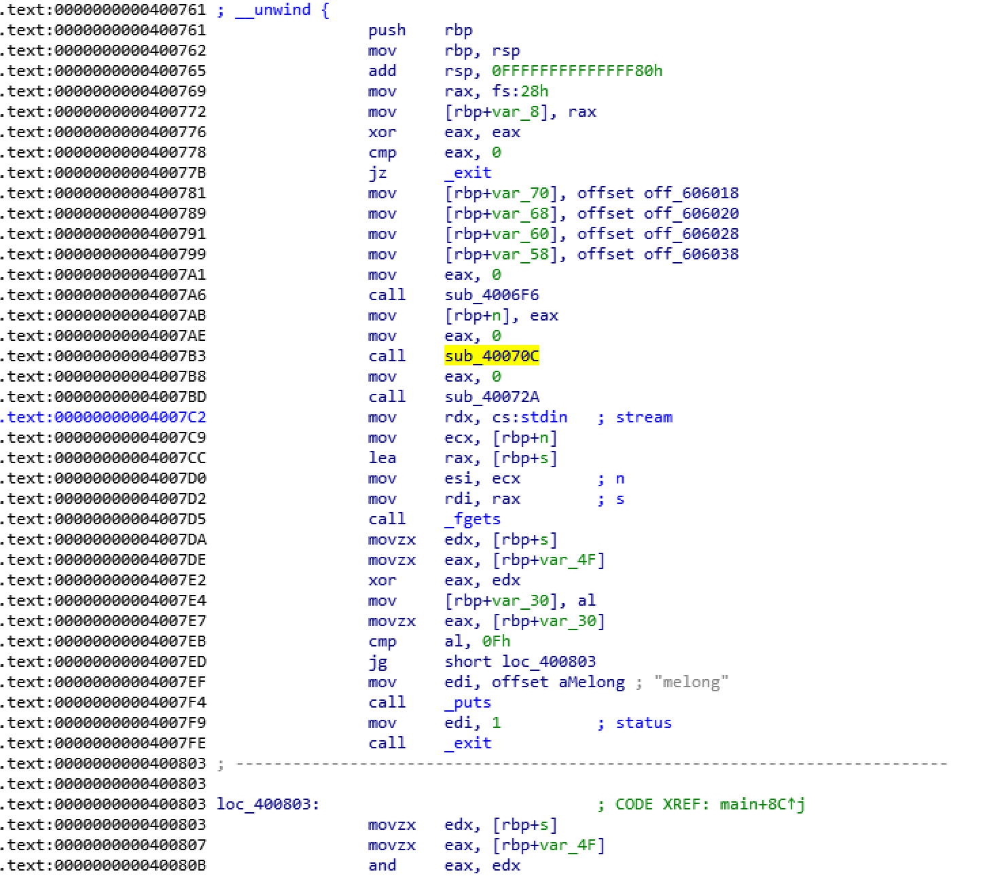
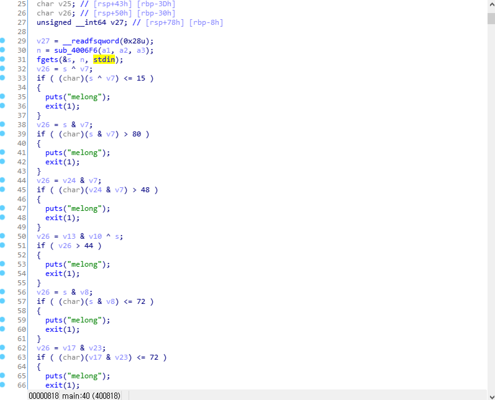

## 2017_codegate_prequal - angry bird(125)

FILE : x64 ELF FILE

메롱을 이따만큼 하는 프로그램이다. 그러나 헥스레이는 딸랑 exit() 함수 하나뿐이다.

방해물이 여럿있다. 동적분석으로 넘어가자.

여기서 프로그램의 정상적인 진행을 방해하는 함수는 40088B의 JZ문과 sub_40070C, sub_40072A이다. (sub_4006F6은 출력 외에 별다른 기능이 없는 듯 하다.)

Edit - Patch Program 기능을 통해 없애버리자.

필자는 CMP EAX,0을 CMP EAX,1로 바꾸고 CALL문을 nop처리 했다. 

그렇게 쓸데없는 코드를 처리하면 제대로 된 코드를 볼 수 있다.

