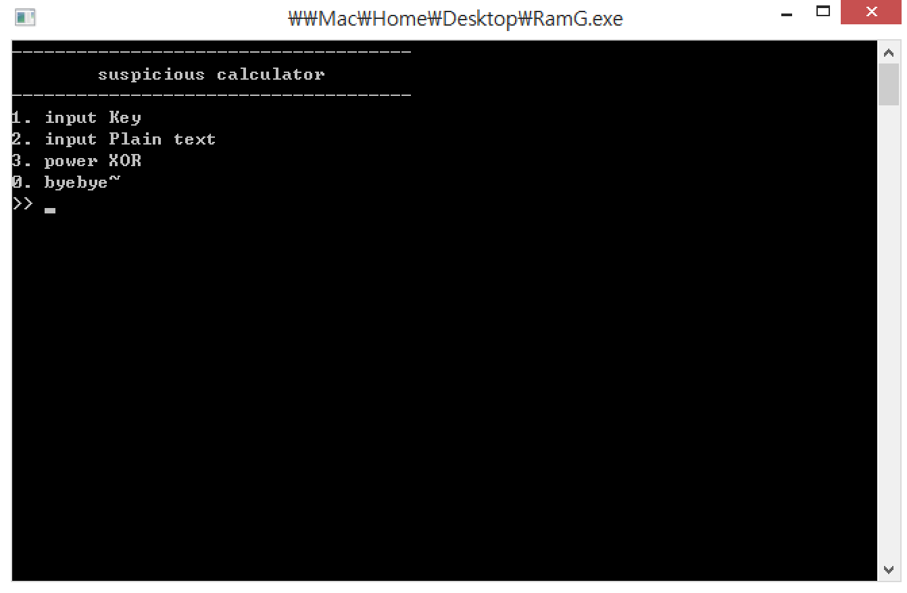
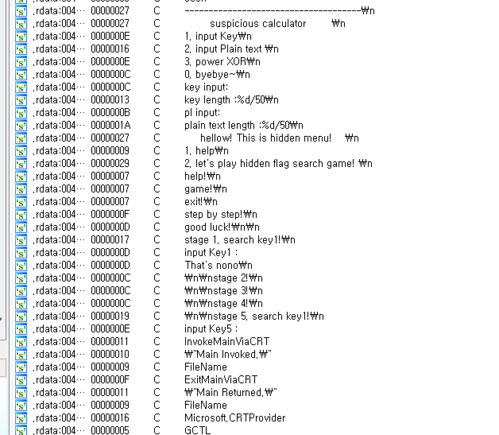
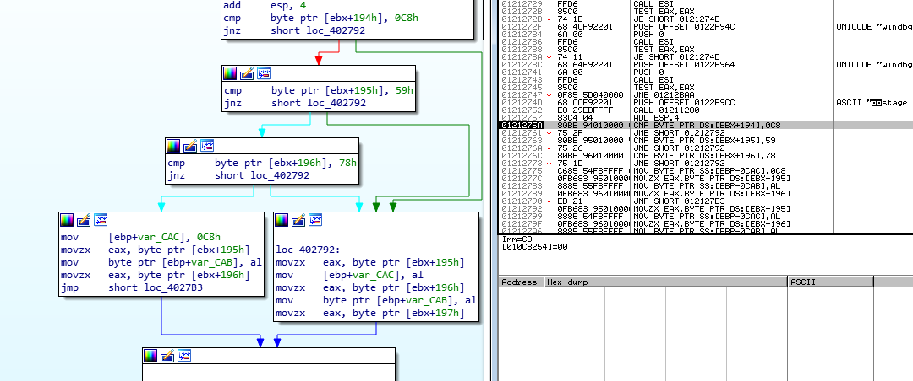
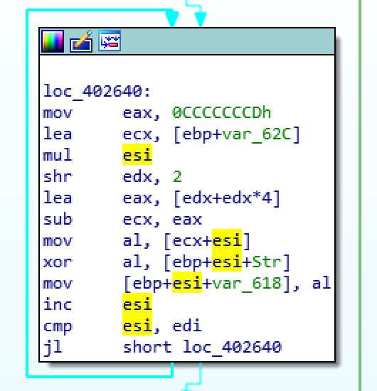
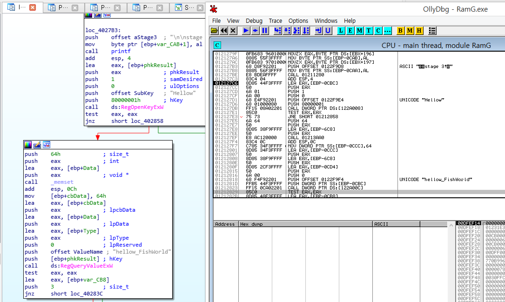
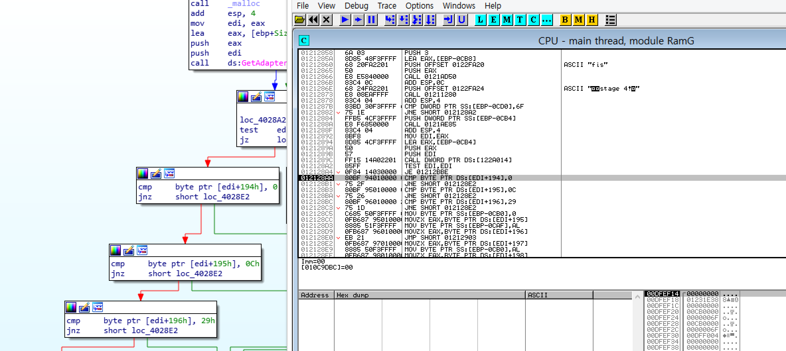
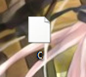
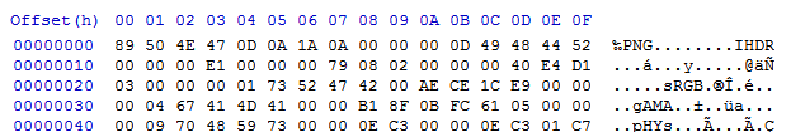
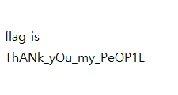

## 2017_CODEGATE_prequal - RamG(130)

FILE : x86 EXE FILE

실행하면 이런 메뉴가 뜬다. IDA로 뜯어보자.

일단 스트링부터.

히든메뉴가 있다고 한단다. 트레이싱해 보면 히든메뉴로 가는 키는 '4'이다.

이후는 동적으로 진행해보자

※ 중간중간에 있는 IsDebuggerPresent등의 안티디버깅 기법은 알아서 해결하시길!

❖ stage1

key를 입력받고 변형한 뒤, 앞 5글자를 비교한다.

아래의 10글자는 

요기서 "4745947459"와 한 문자씩 XOR된 값이다. 

XOR 이후 비교를 한다. 대충 구하면 "yamyambugs"임을 알 수 있다.

❖ stage2

이 부분에서 3개를 비교하고 분기한다. and함수인 것을 보면 다 맞아야하는 모양이다. 자세히는 모르겠으나 일단 적당히 맞춰주자. 근데 그 값을 이용하는것으로 보이므로 스택을 수정하는 것이 올바른 방향같다.

❖ stage3

Hellow란 키가 HKEY_CURRENT_USER에 있는지, 또 거기에 hellow_FishWorld라는 값이 있는지 체크한다. 만들어주자.

❖ stage4

stage2랑 비슷하다. 스택 잘 맞춰주자.

❖ stage5

다시 한 번 키를 받는데, 

똑같은 짓 또 한다... "3674231096"이란 문자열과 XOR한다.

이후 비교해보면 앞 문자열 5개가 "hellowfish"임을 알 수 있다.

❖ LAST

모두 클리어(?)하면 "c"라는 파일을 만들어준다.

png파일이다. 열어주자.

flag is ThANk_yOu_my_PeOP1E