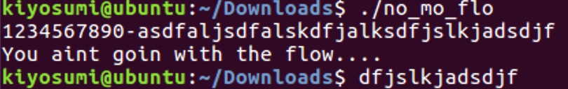
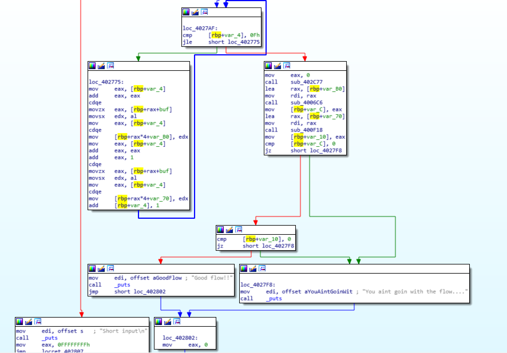
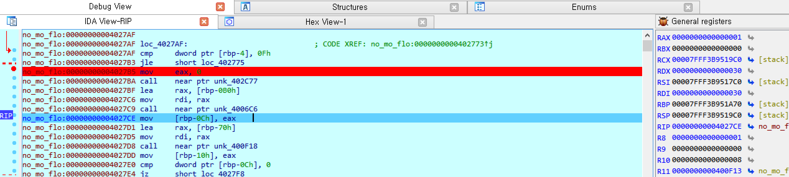
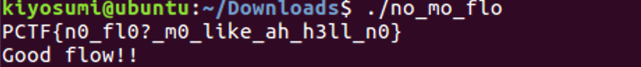

# 2017_PlaidCTF - no_mo_flo(125)

FILE : x64 ELF FILE

문자열 32개를 가져와 뭔가 체크한다.

IDA로 열어보자.

홀수번째 문자, 짝수번째 문자를 각각 다른 버퍼에 저장하고, 함수 sub_4006C6, sub_400F18을 통해 홀수번째/짝수번째 문자들을 각각 검증한다.

동적분석을 통해 살펴보면 sub_4006C6이 홀수번째, sub_400F18이 짝수번째 문자를 검증한다.

각각 직접 분석해주면 되겠다.

단, sub_4006C6은 JZ와 JNZ가 각각 나뉘어있는데 JNZ 분기문에 낚여 시간을 낭비하지 않도록 하고(필자도 같은 문자를 또 검증하는 이상한 상황에 당황하였다.), sub_400F18도 중간에 장난치는 부분이 있다. 찍든 노가다를 하든 적당히 구하자.

루틴을 잘 통과하면

EAX값이 1이 되는 것을 통해 정확히 구했는지 확인할 수 있다. 필자는 sub_400F18 함수는 약간 머리를 굴려서 문자 몇개를 게싱했다.

하여튼 구해서 짝/홀수 문자들을 이어붙이면

flag is PCTF{n0_f10?m0_like_ah_h3ll_n0}

