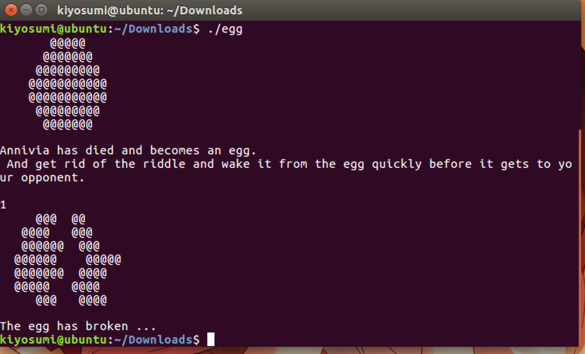
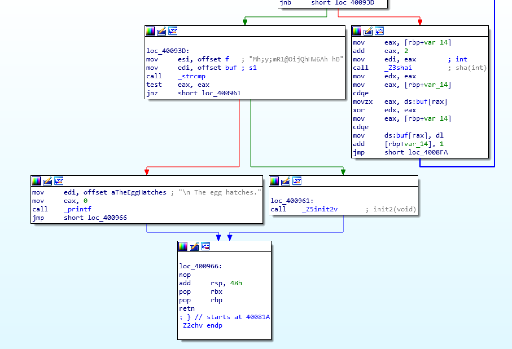
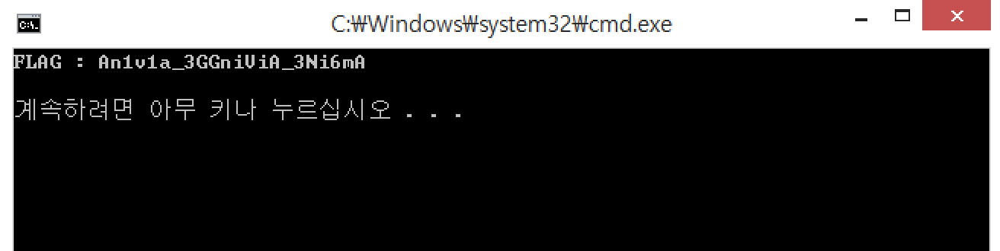
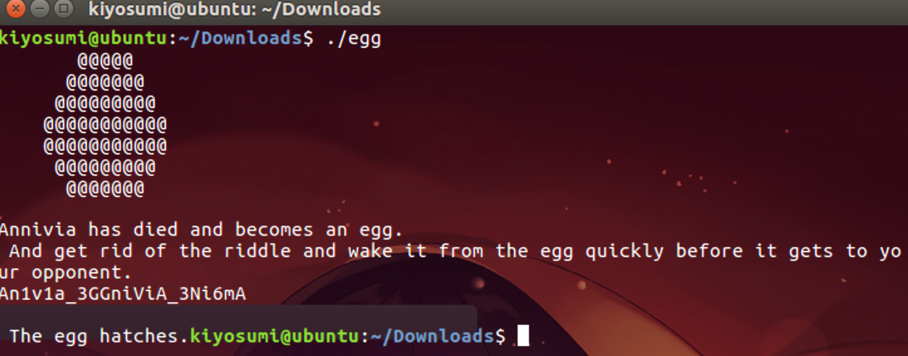

# 2017_ROOTCTF - EGG

FILE : x64 ELF FILE



알을 안 깨먹으면 되는 프로그램 같다.

IDA로 열면



대충 이러한 루틴을 통과하여 패스워드를 검증한다. 

패스워드 제작 루틴은 뭔가 복잡해보인다. 그러나 자세히 들여다보면 XOR이 전부이며, XOR하는 값들은 입력한 값이 영향을 끼치지 않으므로 동적분석을 통해 구할 수 있다.


XOR하는 값은 아래의 sha[]와 같다.

### Solution Code

```c
#include <iostream>

int sha(int a){
	return 0;
}

int main(){
	char answer[] = "Mh;y;mR1@OijQhHW6Ah=hB";
	char sha[] {0x0C, 0x06, 0x0A, 0x0F, 0x0A, 0x0C, 0x0D, 0x02, 0x07, 0x08, 0x07, 0x03, 0x07, 
		0x01, 0x09, 0x08, 0x05, 0x0F, 0x01, 0x0B, 0x05, 0x03};

	for (int i = 0; i < 22; i++)
		answer[i] ^= sha[i] ;

	printf("%s", answer);
}
```

  



flag is An1v1a_3GGniViA_3Ni6mA