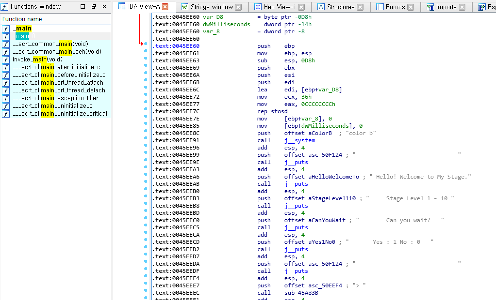
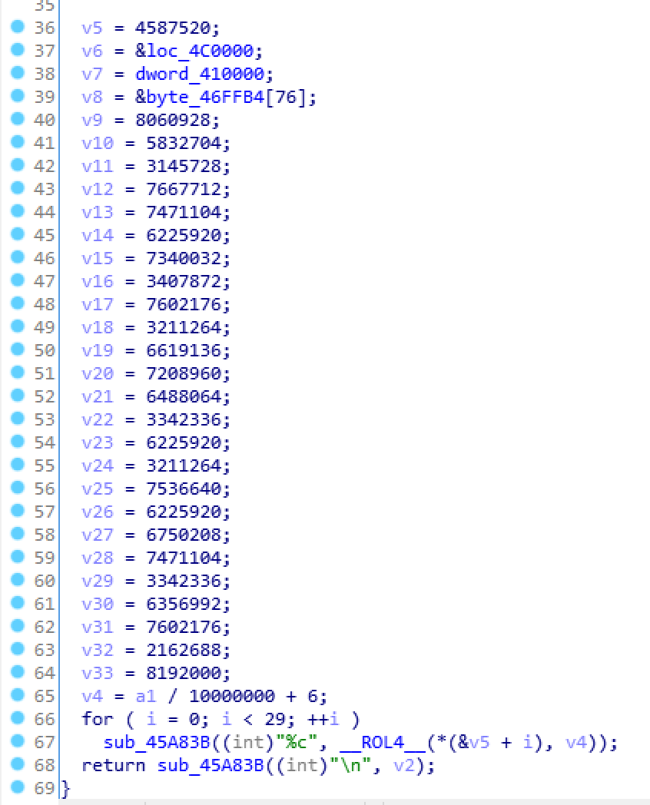
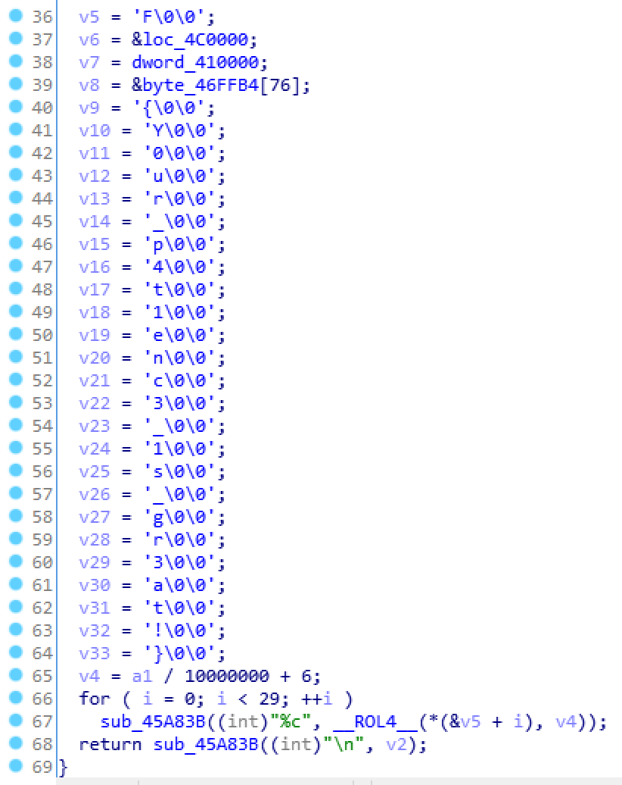
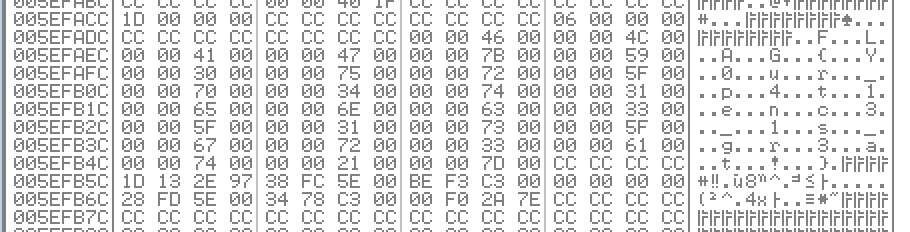

# 2017_rootctf - Stage

FILE : x86 Executable

실행해보면 광속(?)으로 1~10까지 세고 꺼져버린다.

IDA로 열어보면 뭔가 함수가 디따 많다. 그러나 친절한 주최자는 함수명을 그대로 넣어줬다.

각각의 숫자별로 함수를 호출하는 방식으로 출력하는데, 9번째와 10번째가 뭔가 다르다. 특히 10번째가 수상하다. 함수를 타고 들어가보자.

아래의 %c와 관련된 함수를 포함하여 매우 수상하게 생겼다. 문자 형으로 변환해 보자.

끝. 2~4번째 문자는 게싱으로 적당히 구해주자...

물론 성실한 필자는 동적분석으로 구했다.

flag is FLAG{Y0ur_p4t1enc3_1s_gr3at!}

