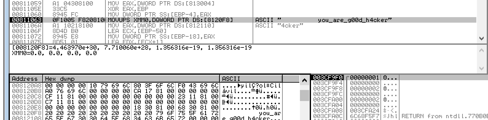

# st341th.com - whereismyflag(100)

FILE : x86 EXE

바로 플래그를 출력해주는데... 문자열이 이상하다.

IDA로 뚜껑을 열어서 String을 둘러보다 보면 상당히 수상해 보이는 문자열이 존재한다.

귀찮으니 동적으로 뚜껑을 열어보자

flag is you_are_g00d_h4cker

※ 왜 플래그가 개판인가?

여기서 flag인 "you_are_g00d_h4cker"과 "argyougoodathacking"이란 문자열을 한 문자씩 XOR기 때문