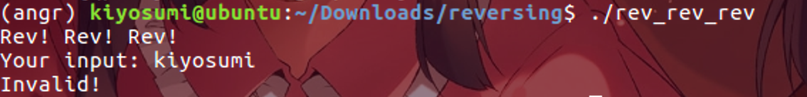
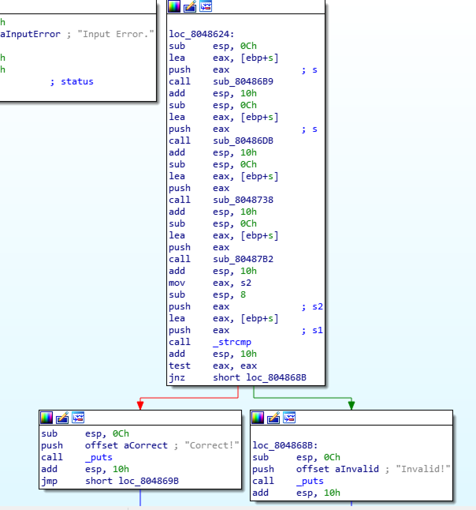
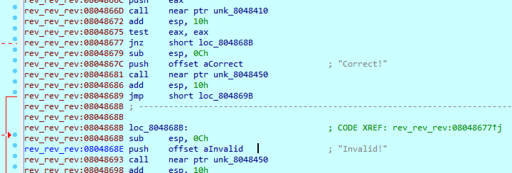
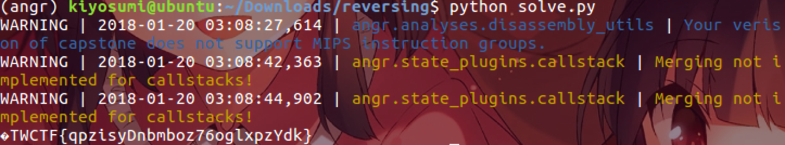

# 2017_TWCTF - rev rev rev(25)

FILE : x86 ELF FILE




간단한 입력프로그램이다.




루틴은 뭔가 짧다. 그러나 중간중간에 섞여있는 함수들이  입력받은 문자열을 재미없게 믹싱한다. 문자 찾고, 문자열 뒤집고... 귀찮다ㅠㅠ




분기점의 주소를 구하고 angr를 쓰자.


### Solution Code

```python
import angr
 
def main():
    p = angr.Project("./rev_rev_rev", load_options={'auto_load_libs': False})
    ex = p.surveyors.Explorer(find=(0x804867c, ), avoid=(0x804868e,), enable_veritesting=True)
    ex.run()
 
    return ex.found[0].state.posix.dumps(0).strip('\0\n')
 
if __name__ == '__main__':
    print main()
```




flag is TWCTF{qpzisyDnbmboz76oglxpzYdk}